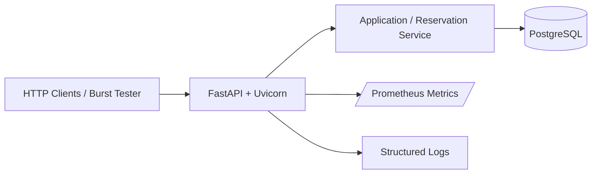
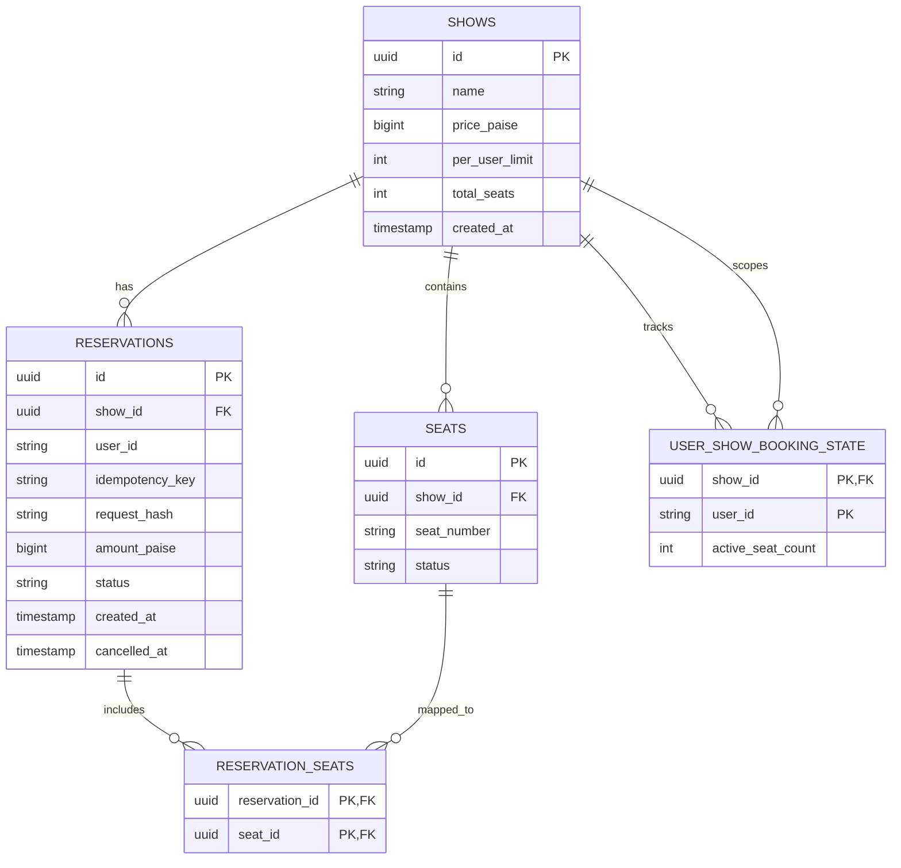

# Architecture Specification: Seat Reservation Service

## 1. System Overview

A small, single-service backend that manages event seat reservations under high contention.

The service is built with:

- Python
- FastAPI
- Uvicorn
- SQLAlchemy
- PostgreSQL
- Alembic
- Docker
- Prometheus-compatible metrics

PostgreSQL is the authoritative source of truth for seat ownership, reservations, idempotency state, and per-user booking state.

The system is intentionally a modular monolith. Correctness is achieved through transactional database operations and database constraints rather than through multiple state stores or distributed coordination services.



---

## 2. Architectural Goals and Non-Goals

### Goals

- Correct seat allocation under high concurrent contention.
- Strict enforcement of per-user booking limits.
- Durable idempotency for successful reservations.
- Atomic multi-seat reservations.
- Safe cancellation and re-booking.
- Clear failure behavior.
- Observable runtime behavior under burst traffic.
- Simple implementation with a small operational footprint.
- Reproducible local and deployed execution through Docker.

### Non-Goals

- Full payment processing.
- A production identity-provider integration.
- A UI.
- Event-driven/microservice decomposition.
- Redis/Kafka/Celery-based coordination.
- Time-boxed holds or background expiry in the initial implementation.
- Features not required by the assignment.

---

## 3. Components

### Client

Sends JSON HTTP requests to the service. The repository also contains a burst/load-test client that can exercise the deployed API concurrently.

### API Layer

FastAPI running under Uvicorn.

Responsibilities:

- HTTP routing.
- Request validation.
- Authentication and authorization boundaries.
- Response formatting.
- Request/correlation ID handling.
- Exposing health and metrics endpoints.

The API layer does not own persistent booking state.

### Application Layer

Contains show and reservation business logic.

Responsibilities:

- Reservation rules.
- Idempotency decisions.
- Transaction orchestration.
- Cancellation rules.
- Mapping domain outcomes to API responses.

### Persistence Layer

SQLAlchemy provides the persistence abstraction and transaction/session management.

The underlying relational database remains the authority for concurrency and durable state.

### PostgreSQL

Stores all authoritative business state and enforces relational integrity, uniqueness, and transactional state changes.

---

## 4. Authentication and Authorization

### Authentication

Reservation and cancellation requests use a signed JWT bearer token:

```http
Authorization: Bearer <token>
```

The authenticated user identity is taken from the verified JWT subject (`sub`). A client-supplied `user_id` in the request body is never trusted for identity.

The signing key is supplied through environment configuration and is never committed to the repository.

A small test-token mechanism may be enabled for evaluation/testing so the burst script and external evaluators can obtain valid tokens for test users. It is isolated from the reservation logic and controlled through deployment configuration.

### Authorization

- Creating a show requires an authenticated admin identity.
- Reserving seats requires an authenticated user identity.
- Cancelling a reservation requires the authenticated user to own that reservation.

Authentication establishes identity; authorization determines whether that identity may perform the requested operation.

---

## 5. Database Model

The architecture uses exactly these five tables.

### Schema DDL

```sql
CREATE TABLE shows (
    id              UUID PRIMARY KEY,
    name            VARCHAR(255) NOT NULL,
    price_paise     BIGINT NOT NULL,
    per_user_limit  INTEGER NOT NULL DEFAULT 4,
    total_seats     INTEGER NOT NULL,
    created_at      TIMESTAMPTZ NOT NULL DEFAULT CURRENT_TIMESTAMP
);

CREATE TABLE seats (
    id          UUID PRIMARY KEY,
    show_id     UUID NOT NULL,
    seat_number VARCHAR(50) NOT NULL,
    status      VARCHAR(20) NOT NULL DEFAULT 'available',

    FOREIGN KEY (show_id)
        REFERENCES shows(id),

    UNIQUE (show_id, seat_number)
);

CREATE TABLE reservations (
    id              UUID PRIMARY KEY,
    show_id         UUID NOT NULL,
    user_id         VARCHAR(255) NOT NULL,
    idempotency_key VARCHAR(255) NOT NULL,
    request_hash    VARCHAR(64) NOT NULL,
    amount_paise    BIGINT NOT NULL,
    status          VARCHAR(20) NOT NULL DEFAULT 'confirmed',
    created_at      TIMESTAMPTZ NOT NULL DEFAULT CURRENT_TIMESTAMP,
    cancelled_at    TIMESTAMPTZ,

    FOREIGN KEY (show_id)
        REFERENCES shows(id),

    UNIQUE (show_id, user_id, idempotency_key)
);

CREATE TABLE reservation_seats (
    reservation_id UUID NOT NULL,
    seat_id        UUID NOT NULL,

    PRIMARY KEY (reservation_id, seat_id),

    FOREIGN KEY (reservation_id)
        REFERENCES reservations(id),

    FOREIGN KEY (seat_id)
        REFERENCES seats(id)
);

CREATE TABLE user_show_booking_state (
    show_id           UUID NOT NULL,
    user_id           VARCHAR(255) NOT NULL,
    active_seat_count INTEGER NOT NULL DEFAULT 0,

    PRIMARY KEY (show_id, user_id),

    FOREIGN KEY (show_id)
        REFERENCES shows(id)
);
```

### Table Responsibilities

*   **`shows`**: show configuration and metadata.
*   **`seats`**: current physical seat state. Current seat ownership is determined from the seat's current `status` plus the active (`confirmed`) reservation relationship.
*   **`reservations`**: committed booking record, authenticated user identity, amount, status, and durable idempotency information.
*   **`reservation_seats`**: relationship between a reservation and its physical seats; preserve this relationship after cancellation for historical booking information. Cancelled reservation relationships remain for history.
*   **`user_show_booking_state`**: current active-seat count for one user within one show, used as the protected state for concurrent per-user limit enforcement.

---

## 6. Data Relationships



---

## 7. API Surface

### Create show
```http
POST /shows
```
Admin authenticated.

**Request:**
```json
{
  "name": "friday-night",
  "seats": ["A1", "A2", "A3"],
  "price_paise": 25000
}
```

The creation of the show and all initial seat rows occurs atomically in one transaction. If creation of any seat fails, the entire show creation rolls back. Duplicate seat identifiers in the input should be rejected during API validation. Returns the created show with a unique ID and every requested seat initialized in the `available` state.

### Reserve seats
```http
POST /shows/{show_id}/reserve
Authorization: Bearer <jwt>
Idempotency-Key: <key>
```

**Request:**
```json
{
  "seats": ["A12", "A13"]
}
```

The authenticated user is derived from the token. Successful creation returns `201 Created` with the reservation details:
```json
{
  "reservation_id": "...",
  "show_id": "...",
  "user_id": "...",
  "seats": ["A12", "A13"],
  "amount_paise": 50000,
  "status": "confirmed"
}
```

### Cancel reservation
```http
POST /reservations/{reservation_id}/cancel
Authorization: Bearer <jwt>
```
Only the reservation owner may cancel it.

### Show state
```http
GET /shows/{show_id}
```
Returns seat-level state and counts derived from the current `seats` state.

### Liveness and Readiness
- `GET /health/live`: Indicates that the application process is running.
- `GET /health/ready`: Checks database reachability. Fails closed when DB is unreachable.

### Metrics
```http
GET /metrics
```
Exposes Prometheus-compatible metrics.

---

## 8. Reservation Transaction Flow

All correctness-critical state changes occur in exactly one database transaction. The sequence is:

1. Authenticate the caller and derive `user_id` from the verified token.
2. Canonicalize and deterministically sort requested seats.
3. Begin the database transaction.
4. Ensure the `(show_id, user_id)` booking-state row exists safely, then lock it for the transaction.
5. Check for an existing committed reservation using the defined idempotency scope.
6. If an existing reservation is found:
   * protect that reservation row before returning the replayed result so replay and cancellation have a clear serialization point;
   * same request fingerprint → replay the original reservation;
   * different request fingerprint → `409 Conflict`;
   * do not modify seat or booking state.
7. Lock all requested seat rows in deterministic order.
8. Verify every requested seat is `available`.
9. Verify the user remains within `per_user_limit`.
10. Create the `reservations` row. The `amount_paise` is calculated server-side as `show.price_paise * requested_seat_count`. The client never supplies the reservation amount.
11. Create the corresponding `reservation_seats` rows.
12. Change all requested seats from `available` to `confirmed`.
13. Increment `active_seat_count`.
14. Commit.
15. Return the successful reservation.

---

## 9. The Atomic-Decision Challenge

The assignment explicitly warns against a read-then-write race and asks where the atomic decision lives.

> The atomic concurrency decision for seat ownership lives in the PostgreSQL transaction. Requested seat rows are locked in deterministic order before their current state is evaluated. The state check and subsequent state transition occur within the same transaction.

- FastAPI `async`/`await` handles concurrent I/O efficiently, but it does NOT provide business-state correctness.
- PostgreSQL transactions and row locking provide correctness for conflicting seat operations.

---

## 10. Hot-Seat Behavior

For many users requesting the same seat (e.g., 500 requests targeting `A12`):
* one transaction obtains the seat lock;
* it sees `available`, creates the reservation, changes the seat to `confirmed`, and commits;
* waiting transactions subsequently observe the seat as `confirmed`;
* those requests return `409 Conflict`;
* no request should produce a `500` merely because the seat was contested.

---

## 11. Multi-Seat Behavior

Multi-seat reservations have all-or-nothing semantics.

For a request such as `["A12", "A13"]`:
* normalize/sort seats;
* lock them in deterministic order;
* require every requested seat to be available;
* if any requested seat is unavailable, no seat is booked and the operation returns `409 Conflict`.

Deterministic lock ordering reduces deadlock risk for overlapping multi-seat requests.

---

## 12. Per-User Limit Concurrency

The `user_show_booking_state` table represents authoritative aggregate booking state for the user/show pair. It is not merely a cache. The `(show_id, user_id)` pair is uniquely constrained.

Concurrent reservations for the same user/show must serialize on this state before the booking-limit decision is made. The row may not exist for a new user/show pair on their first request. The initial row creation must be concurrency-safe using the uniqueness constraint and transactional insert/conflict handling, followed by protecting the resulting row for the transaction. Do not introduce a specialized database-specific locking mechanism for this initial creation.

---

## 13. Idempotency Semantics

The idempotency scope is:
`show_id + authenticated_user_id + idempotency_key`

The request fingerprint is based on the canonical logical reservation request, including the requested seat set.

* **new key** → normal reservation;
* **same key + same logical request** → protect the existing reservation row for serialization against cancellation, then return the existing committed reservation;
* **same key + different request** → `409 Conflict`;
* **transaction rollback** → no committed reservation/idempotency state remains and a later retry may attempt again;
* **commit followed by lost response** → retry returns the committed reservation;
* **concurrent duplicate requests** → database uniqueness plus transactional serialization ensures only one committed reservation.

---

## 14. Cancellation

Cancellation is an explicit state transition. The cancellation transaction performs the following steps:

1. authenticate;
2. lock reservation;
3. verify ownership;
4. verify reservation is `confirmed`;
5. protect the user's show booking state;
6. obtain the affected seats through `reservation_seats` and protect them in deterministic order;
7. change those seats from `confirmed` to `available`;
8. decrement `active_seat_count`;
9. mark reservation `cancelled`;
10. set `cancelled_at`;
11. commit atomically.

Historical `reservation_seats` rows are NOT deleted during cancellation. Cancellation cannot overwrite a newer reservation because the affected seat state is protected during the transaction before changing it.

---

## 15. Show-State and Reconciliation

**Database representation:**
* seat `available`
* seat `confirmed`

**API representation:**
* `available`
* `held` = 0
* `confirmed`

The API counts are derived entirely from the current `seats` rows, not stored as a second capacity state. 

The API-level invariant remains:
`available + held + confirmed == total_seats`

For this implementation, since `held = 0`, it effectively means:
`available + confirmed == total_seats`

---

## 16. Error and Failure Handling

### Domain outcomes
Expected booking conflicts are intentional application outcomes and return `4xx`:
- seat already unavailable → `409 Conflict`
- per-user limit exceeded → `409 Conflict`
- same idempotency key with a different request → `409 Conflict`

### System failures
Unexpected database/infrastructure failures are not converted into fake business conflicts. They return `5xx`. The system guarantees that normal contention and domain declines are not misclassified as server errors.

---

## 17. Observability

### Metrics
Expose at least:
- confirmed reservation counter;
- declined reservation counter by reason, including seat contention and user-limit rejection;
- idempotent replay counter;
- available-seat gauge;
- reservation latency histogram.

Metric labels must remain bounded. Do not use arbitrary user IDs, seat IDs, request IDs, or reservation IDs as metric labels.

### Logs
Use structured JSON logs with a request/correlation ID. Do not log tokens, secrets, or unnecessary sensitive information.

---

## 18. Deployment Architecture

The application is containerized so that local execution and deployment use the same application artifact. Configuration is supplied through environment variables.

Initial deployment:
```text
Internet
   |
   v
Render Web Service
   |
   v
FastAPI / Uvicorn
   |
   v
Render PostgreSQL
```

The application does not contain Render-specific business logic and remains portable to another container platform.

---

## 19. Burst / Load Testing

The repository includes a one-command burst test that can target both local and live environments. It simulates scenarios such as:
- many users competing for one hot seat;
- concurrent requests from one user near/over the booking limit;
- concurrent identical idempotency requests;
- overlapping multi-seat requests.

The primary correctness check for a hot-seat test is: exactly one successful reservation for the contested seat, zero double-ownership, zero unexpected 5xx responses, and passing reconciliation.

---

## 20. Important Invariants

1. A seat must never be confirmed for more than one user at the same time.
2. A user's active seats for a show must never exceed `per_user_limit`.
3. A successful idempotency key must never create a second reservation.
4. Reusing an idempotency key with a different request must return `409 Conflict`.
5. Expected business conflicts must return appropriate `4xx` responses, not server errors.
6. Reservation state changes must be atomic.
7. Multi-seat reservations are all-or-nothing.
8. Money is represented using integer paise.
9. Persistent correctness does not depend on process-local or in-memory state.
10. `available + held + confirmed == total_seats` must remain true.

---

## 21. Open Implementation Details

The core architecture, data schema, and concurrency mechanisms are strictly defined. The following are intentionally left to implementation detail:

1. Exact Python module/package layout.
2. Exact SQLAlchemy model and relationship syntax.
3. Exact Alembic migration file structure.
4. JWT library and precise token validation configuration.
5. Exact API error payload schema.
6. Exact metric names.
7. Exact logging library/formatter.
8. Exact burst-test concurrency implementation and CLI arguments.

These details must remain consistent with this architecture and the project requirements.
